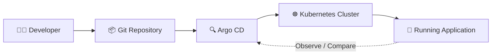
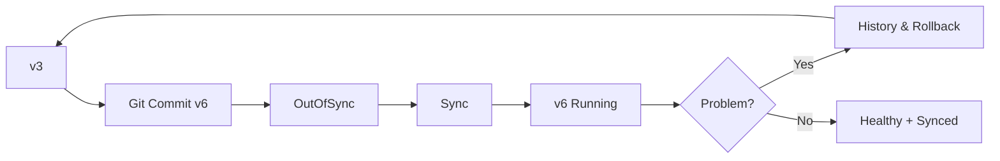
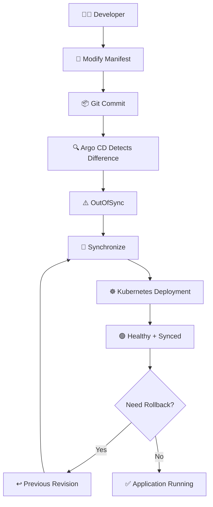

# 🚀 Argo CD — Create an Application Using the UI

> **GitOps hands-on guide:** Create, sync, update, roll back, and delete a Kubernetes application using the **Argo CD Web UI**.

---

## 🧭 What You'll Learn

| # | Topic | Outcome |
|---|---|---|
| 1 | 📦 Repository | Understand the demo Git repository and manifests |
| 2 | 🖥️ Argo CD UI | Create an Argo CD Application |
| 3 | 🔗 Git Connection | Connect a Git repository over HTTPS |
| 4 | 🚀 Sync | Deploy Kubernetes resources from Git |
| 5 | 🔄 Update | Change an image version through Git |
| 6 | ↩️ Rollback | Restore a previous application revision |
| 7 | 🗑️ Delete | Remove the application resources safely |

### 🔁 GitOps Mental Model



> **Core idea:** Git is the desired state. Argo CD continuously compares the desired state in Git with the live state in Kubernetes.

---

## 1. 📦 Demo Repository

This lesson uses **Gitea** as the self-hosted Git service. The same workflow can be adapted to GitHub, Bitbucket, or GitLab.

The demo repository is:

```text
gitops-argocd
└── solar system/
    ├── deployment.yaml
    └── service.yaml
```

The `solar system` directory contains the Kubernetes manifests used by Argo CD.


---

## 2. ☸️ Kubernetes Manifests

### Deployment

The Deployment runs the `solar-system` application with:

- **1 replica**
- Custom image `siddharth67/solar-system:v3`
- Container port **80**
- `imagePullPolicy: Always`

```yaml
apiVersion: apps/v1
kind: Deployment
metadata:
  labels:
    app: solar-system
  name: solar-system
spec:
  replicas: 1
  selector:
    matchLabels:
      app: solar-system
  strategy: {}
  template:
    metadata:
      labels:
        app: solar-system
    spec:
      containers:
        - image: siddharth67/solar-system:v3
          name: solar-system
          imagePullPolicy: Always
          ports:
            - containerPort: 80
```

### Service

The Service exposes the application using a **NodePort**.

```yaml
apiVersion: v1
kind: Service
metadata:
  labels:
    app: solar-system
  name: solar-system-service
spec:
  ports:
    - port: 80
      protocol: TCP
      targetPort: 80
  selector:
    app: solar-system
  type: NodePort
```

---

# 3. 🖥️ Create the Argo CD Application

## Step 1 — Open Argo CD

From the Argo CD UI:

1. Click **+ New App**
2. Enter an application name, for example:

```text
solar-system-app-1
```

3. Select the Argo CD project:
   - `default`
4. Select the synchronization policy:
   - **Manual**
5. Configure the source repository.


---

## Step 2 — 🔗 Configure the Git Repository

Go to:

```text
Argo CD → Manage Repositories
```

Argo CD supports:

- SSH
- HTTPS
- GitHub App

For this demo, use **HTTPS**.


Enter:

```text
Repository URL
Username        → required for private repositories
Password        → required for private repositories
TLS certificate → optional
```

Click **Connect**.

A successful connection should show a successful status.


> 🔐 **Security note:** Argo CD stores repository connection details in Kubernetes Secrets.

Check the Secrets:

```bash
kubectl -n argocd get secrets
```

Example:

```text
NAME                              TYPE    DATA  AGE
argocd-initial-admin-secret       Opaque  1     60m
argocd-secret                     Opaque  5     61m
repo-3254474260                   Opaque  3     52s
```

Inspect a repository Secret:

```bash
kubectl -n argocd get secrets repo-3254474260 -o json
```

Repository fields such as `project`, `type`, and `url` are stored in encoded form.

---

# 4. ⚙️ Configure Application Source & Destination

Return to **New Application**.

### Source

Select the repository you connected.

Set the path to:

```text
solar system
```

### Destination

Select:

```text
Cluster → Kubernetes cluster where Argo CD is installed
Namespace → solar-system
```

You can enable:

```text
Auto-create namespace
```

if the namespace does not already exist.

Then click:

```text
Create
```


---

## 🔎 Initial Application State

Immediately after creation, the application may show:

```text
Health:       Missing
Sync Status:  OutOfSync
```

This is expected because the Kubernetes resources have not yet been deployed.

Verify the cluster:

```bash
kubectl get ns
kubectl get pod -A
```

At this point, the `solar-system` namespace and its resources should not yet be present.

---

# 5. 🚀 Synchronize the Application

Click:

```text
Sync
```

Argo CD detects the Kubernetes resources from Git:

```text
Git Repository
     │
     ▼
Argo CD
     │
     ├── Deployment
     └── Service
     │
     ▼
Kubernetes
```

## ⚠️ Common Issue: Missing Namespace

If `solar-system` does not exist, synchronization may fail.


### Fix

Either:

```bash
kubectl create namespace solar-system
```

or enable:

```text
Auto-create namespace
```

Once the namespace is available, synchronize again.

### ✅ Expected Result

```text
Health:       Healthy
Sync Status:  Synced
```


Verify:

```bash
kubectl get ns
kubectl -n solar-system get all
```

---

# 6. 🔍 Inspect the Deployed Service

The live Service can be inspected from the Argo CD UI.

A typical Service looks like:

```yaml
apiVersion: v1
kind: Service
metadata:
  name: solar-system-service
  namespace: solar-system
spec:
  ports:
    - nodePort: 30280
      port: 80
      protocol: TCP
      targetPort: 80
  selector:
    app: solar-system
  type: NodePort
```

The application can be accessed through the NodePort, for example:

```text
http://<NODE-IP>:30280
```

The v3 image displays a limited set of planets.

---

# 7. 🔄 Update the Application Image

Now simulate a new application release.

Change:

```yaml
image: siddharth67/solar-system:v3
```

to:

```yaml
image: siddharth67/solar-system:v6
```

The updated Deployment becomes:

```yaml
apiVersion: apps/v1
kind: Deployment
metadata:
  labels:
    app: solar-system
  name: solar-system
spec:
  replicas: 1
  selector:
    matchLabels:
      app: solar-system
  strategy: {}
  template:
    metadata:
      labels:
        app: solar-system
    spec:
      containers:
        - image: siddharth67/solar-system:v6
          name: solar-system
          imagePullPolicy: Always
          ports:
            - containerPort: 80
```

Commit the change:

```text
Updated the image to v6
```


---

# 8. 🔍 Argo CD Detects the Change

After the Git commit, Argo CD checks the repository for changes.

To detect the change immediately, perform a **Hard Refresh** in the UI.

The application should become:

```text
Sync Status: OutOfSync
```

Then click:

```text
Synchronize
```

Argo CD will:

1. Detect the new desired state.
2. Update the Deployment.
3. Create a new ReplicaSet.
4. Start a new Pod.
5. Run the new image version.


---

# 9. ↩️ Roll Back a Release

If the new version produces unexpected behavior, Argo CD can roll back to a previous revision.

Navigate to:

```text
History and Rollbacks
```

Then:

1. Select the previous revision.
2. Confirm the rollback.
3. Argo CD restores the previous application state.


### 🔁 Deployment Lifecycle



---

# 10. 🗑️ Delete the Application

To delete the application:

1. Delete the application from the Argo CD UI.
2. Argo CD removes the associated Kubernetes resources.
3. The target namespace remains intact.

Resources removed include:

```text
Deployment
ReplicaSet
Pod
Service
```

Verify:

```bash
kubectl get ns
kubectl -n solar-system get all
```

### Before Deletion

```text
kubectl -n solar-system get all

NAME                                        READY   STATUS    RESTARTS   AGE
pod/solar-system-556d76fc6-mxk6z           1/1     Running   0          34s
service/solar-system-service                NodePort 10.108.211.169 <none> 80:30280/TCP 34s
deployment.apps/solar-system                1/1     1         1          34s
replicaset.apps/solar-system-556dd76fc6      1       1         1          34s
```

### After Deletion

```bash
kubectl -n solar-system get all
```

Expected:

```text
No resources found in solar-system namespace.
```

The namespace itself remains:

```bash
kubectl get ns
```

Example:

```text
argocd           Active
default          Active
kube-node-lease  Active
kube-public      Active
kube-system      Active
solar-system     Active
```

---

# 🧠 Quick Revision Sheet

| Task | Action / Command |
|---|---|
| Create App | **+ New App** |
| Git source | Select repository |
| Manifest path | `solar system` |
| Sync policy | **Manual** |
| Destination namespace | `solar-system` |
| Deploy | **Sync** |
| Check namespaces | `kubectl get ns` |
| Check resources | `kubectl -n solar-system get all` |
| Refresh Git state | **Hard Refresh** |
| Apply Git change | **Synchronize** |
| Rollback | **History and Rollbacks** |
| Delete app | Delete from Argo CD UI |

---

# 🎯 Key Interview Points

### What is Argo CD?

> Argo CD is a declarative GitOps continuous delivery tool for Kubernetes. It continuously compares the desired state stored in Git with the live state in the cluster.

### What does `OutOfSync` mean?

> `OutOfSync` means the desired state in Git differs from the current live state in Kubernetes.

### What does `Synced` mean?

> `Synced` means the live Kubernetes resources match the desired state defined in Git.

### What does `Healthy` mean?

> `Healthy` indicates that Argo CD considers the deployed application resources to be operating as expected.

### What happens when the Git image changes?

```text
Git image change
      ↓
Argo CD detects difference
      ↓
Application = OutOfSync
      ↓
Synchronize
      ↓
Deployment updated
      ↓
New ReplicaSet
      ↓
New Pod
```

---

# 🏁 End-to-End GitOps Flow



---

## 📌 Final Takeaway

The complete GitOps workflow demonstrated here is:

```text
Git Repository
      ↓
Argo CD Application
      ↓
Repository Configuration
      ↓
Application Source + Destination
      ↓
Sync
      ↓
Kubernetes Resources
      ↓
Healthy + Synced
      ↓
Git Change
      ↓
OutOfSync
      ↓
Synchronize
      ↓
New Version
      ↓
Rollback if required
```

> **Remember:** In this workflow, Git defines the desired state, Argo CD reconciles that state, and Kubernetes runs the resulting resources.

---

### 📚 Source

This Markdown is a visually reorganized version of the provided lesson content. fileciteturn0file0L73-L90
